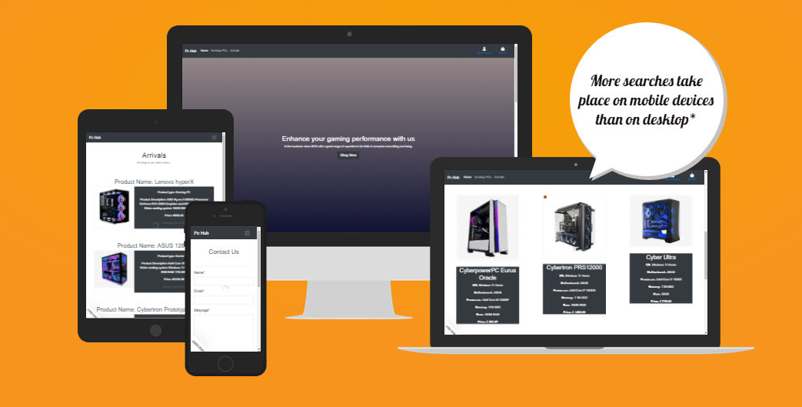
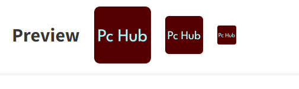
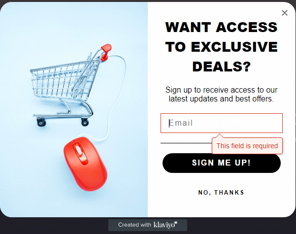
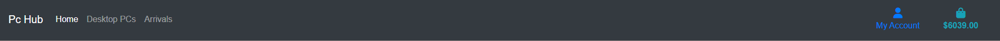
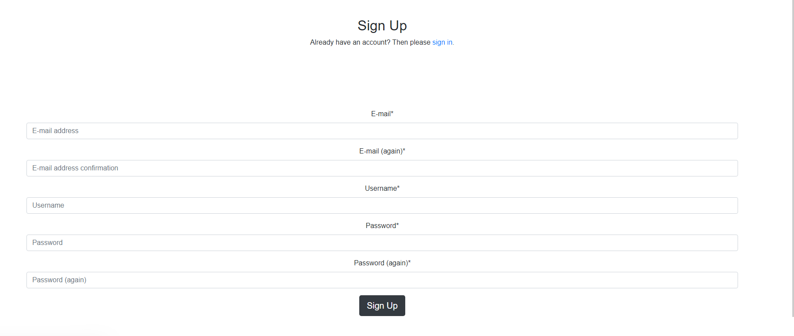
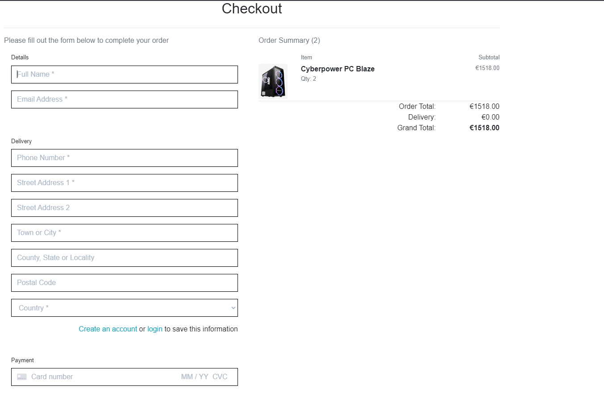

# [Welcome to PC HUB](http://pchub-ac046d943cba.herokuapp.com/)

## Introduction

Welcome to my very own [PC HUB](http://pchub-ac046d943cba.herokuapp.com/).
THIS WEBISTE IS FOR EDICUATIONAL PURPOSES ONLY.
I wanted to create an full-stack e-commerce web application selling gaming computers which I am very passionate about.

## Business Type

The approach I took to this topic is a B2C type of business which means its Business To Customer.

- Business goals addressed with this site
- Build brand awareness;
- Prensent the business value proposition with high-quality content;
- Catch customer's attention and offer a good experience on buying a new Gaming Pc.

How to test a payment:
 
CARD NUMBER:
Visa (debit)	4000056655665556
 
CVC: 
ANY 3 DIGITS
 
DATE:
ANY FUTURE DATE
 

## Market Strategy

- Facebook was used as our main marketin strategy taking advantage of Facebook's popularity to set a fine field for business growth and healthy competition. 

## Database Design

- The database diagram explains the properties of each model and describest their relationship between eachother 
   (if they have any)

- The database diagram was created using DBeaver

## AGILE Methodology

### User Stories

All User Stories were successfully performed.
Each respective User Story was seperated in a milestone making for a more organised project and helping keeping track of tasks and functions planned to be implemented. Each milestone has a collection of issues that I thought would be helful towards finishing the project and i seperated them in either Fton-Ebd or Back-end.
You can access them [here](https://github.com/users/andreasarreqi/projects/13)

All projects were assigned to epics, prioritized under the labels, Must have, should have, could have. They were assigned to piriority levels "Low Priority" "Medium Priority" "high Priority" . "Must have" stories were completed first, "should haves", "could haves" and finally "Wont have". It was done this way to ensure that all core requirements were completed first to give the project a complete feel, with the nice to have features being added should there be capacity.

The User Stories board was created using github projects and can be viewed to see more information on the project cards. All stories except the documentation tasks have a set of acceptance criteria in order to define the functionality that marks that story as complete.

#### Epics

The project had 7 main Epics (milestones):

EPIC 1 - Site Functionality

The base setup epic is for all stories needed for the base set up of the application. Without the base setup, the app would not be possible so it was the first epic to be delivered as all other features depend on the completion of the base setup.

1. As a developer, I need to set up the general functionality of the website

            
 1. Acceptance Criteria 

 

2. As a developer, I want to create the base.html page and structure so the other pages can use the layout

    

            
 2. Acceptance Criteria 

                 Install Bootstrap
                 Create base.html file
                 Create home app
                 Create home template
                 Add home content
                 Add base.css
                 Create home page sections
                 Style home page sections
    

 

3. As a developer, I need to create a responsive functional navigation bar

    

            
3. Acceptance Criteria 

                Create nav links structure
                Create main nav
    

 

4. As a developer, I need to create a footer section on the main home page so the user can have a contact emain, Privacy Policy and social media links.

    

            
4. Acceptance Criteria 

                Create footer
                Add contact link
                Add Privacy Policy link
                Add social media link
    

5. As a user , I want to be able to contact the website owners

            
 5. Acceptance Criteria 

                Create contacts model
                Create contacts.html
                Create PC technician model
                Create pc_technician.html

 

6. As a developer, I need to set up AWS to store static files of the project

            
 Acceptance Criteria 

                Create AWS account
                Create s3 bucket
                Create bucket user
                Create bucket group
                Set up config variables on settings.py file
                Test AWS static files collection

 

6. As a developer, I need to create error pages for the website

            
 Acceptance Criteria 

                Create 404.html
                Create 500.htm

 

7. As a developer, i need to setup the application for Search Engine Optimization

            
 Acceptance Criteria 

                Add the proper Meta tags
                Create robots.txt
                Create sitemaps
                Email Marketing Newsletter

 

EPIC 2 - Admin 
The Admin epic is for all stories needed for the Admin  related soories.

1. As a developer, I need to create a super user to maintain and update the website.

            
 1. Acceptance Criteria

                Create super user

 

2. As a developer, i need t o implement create/read/update/delete functionality.

            
 2. Acceptance Criteria

                Allow admin to create/read/update/delete a product on the web page

 

3. As a developer, I need to allow the admins to delete a product from the front-end

            
 3. Acceptance Criteria 

                Created The view
                Create the template
                Create the form code

 

EPIC 3 - Account
The Account epic is for all stories related to account

ACCOUNT - USER STORIES

1. As a developer i need to install allauth so the users can register, login, logout.

            
 1. Acceptance Criteria

                Install Allauth
                Create proper links for users to register/login
                Create my profile path so the user can view their purchases

 

2. As a user, I want to be able to have a profile section.

            
 2. Acceptance Criteria

                Create Profiles app
                Create Profile models
                Create profile views
                Create profile templates
                Create profile templates

 

3. As a developer, I need to implement toasts so the user can get feedback based on their actions on the website

            
 3. Acceptance Criteria

                Create Register toasts
                Create Login toasts
                Create Logout toasts
                Toasts display when product is added to bag
                Toasts display when product is deleted from bag
                Toasts when contact/pc technician forms are submitted

 

4. As a user, I want my personal details to be saved so i would not have to re-type everything everytime i want to buy a product

            
 4. Acceptance Criteria

                Save user details on the web page

 

5. As a user, I want to be able to view products that will be arriving soon to the shop.

            
 5. Acceptance Criteria

                Create arrivals app
                Create arrivals model
                Create arrivals view
                Create arrivals template
                Add arrival posts to the website

 

EPIC 4 - Products

This epic is for all stories related to products.

PRODUCTS - USER STORIES

1. As a developer , I need to create the products app so the user can navigate through the products

            
1. Acceptance Criteria 

                Create the products app
                Create super user
                Create the necessary database models

 

2. As a developer, I need to create the product models

            
2. Acceptance Criteria 

                Create Computers model
                Add computer products to database

 

3. As a developer, I need to create the products templates so the user can view the websites products

            
3. Acceptance Criteria 

                Create computers.html
                Create computer_detail.html
                Style computer_detail.html

 

4. As a user, i would like to see the add products to bag and view the bag contents

            
4. Acceptance Criteria 

                Create bag app
                Create bag templates
                Create bag views
                Create bag templatetags
                Add product to bag
                Update product from bag
                Delete product from bag
                Fix quantity input from decrementing below 0 value

 

EPIC 5 - Payments

This epic is for the payment related stories

How to test a payment:
 
CARD NUMBER:
Visa (debit)	4000056655665556
 
CVC: 
ANY 3 DIGITS
 
DATE:
ANY FUTURE DATE
 

PAYMENTS - USER STORIES

1. As a user, I would like to be able to checkout/purchase the products i chose

            
1. Acceptance Criteria 

                Create checkout app
                Create Checkout models
                Create signals.py
                Create forms.py
                Modify apps.py
                Create checkout views
                Create checkout templates
                Create css folder in the checkout app

 

2. As a developer, I need to set up a secure payment system with stripe.

            
2. Acceptance Criteria 

                Install Stripe
                Test payment
                Create Webhooks.py
                Create webhook_handler.py
                Add stripe keys to env
                Add stripe to settings.py

 

EPIC 6 - Deployment

This epic is for the deplyoment related stories

DEPLOYMENT - USER STORIES

1. As a user, I want to see a live website application.

            
1. Acceptance Criteria 

                Deploy to Heroku

 

EPIC 7 - Documentation

This epic is for all document related stories and tasks that are needed to document the software development lifecycle of the application. It aims to deliver quality documentation, explaining all stages of development and necessary information on running, deploying and using the application.

DOCUMENTATION - USER STORIES

As a developer, I want to create a README file to document every step I took creating the project

 Acceptance Criteria 

- Anyone can see the procces of this page's development

 

### Features

Favicon

- The icon on the Browser tab next to the website name.
- There to help the user navigate easier through the browser tab.

 
 

Main Page

- Main page contains the nav bar
- Page sections
- Footer
- Newsletter subscription form

- The first section of the page containing a Header and a link to the shopping page.

  
 
 

 - The second section of the page containing a PC SHOP card and a PC TECHNICIAN card with the link to pc 
   technician form

   
  
  
  

  - The third section of the page containing 3 cards explaining why the costumer should choose us.

  

- The newsletter form allows the users to subscribe to the latest deals.

 

Navigation Bar

Footer

- Footer contains the Social Media link that redirect to each respective link
- Footer contains Opening Hours
- Footer contains Contact link and Privacy policy link
- Footer contains the creator of the website

Login Form

- Login form allows users to log into the website

   
  
  

Logout Form

- Logout form allows user to log out of t he website

  

Register Form

- Register form allows user to create their own account

  
   

Contact Us

- Contact form allows user to contatt the website's administrators.

 PC Technician form

    - Contact form allows user to contatt the website's administrators.

 Update/Delete Form

- Allows admin to update a product from the front-end

- Allows admin to update/delete a product from the front-end

- Allows admin to add a product from the front-end.

 Arrivals Page 

- The page contains products that will soon be available in the store giving the users a short descritpion on   
  what  the product looks like, what it contains and how much it costs.

 Computers page 

- The computers page contains all the products in our store with a descrption about the product.

 Computer detail page 

- The computers Detail page contains the individual product with their respective image and their own properties 
  and description    
- The computer detail page contains a keep shopping button which redirects user to computers page.
- The computer detail page contains add to bag button which allows user to add a product to the bag

 Bag 

- The bag contains the product image

- The bag contains the product price

- The bag contains the product quantity

- The bag contains the product update/remove buttons that allows the user to update quantity and remove the item 
   from bag

- The bag contains the sub total

- The bag contains the delivery cost

- The bag contains the product grand total

- The bag contains the product keep shoping button and the checkout button

 Toasts 

- Toast/Messages notify the users of their action. 

Toasts appear when:
- User creates an account
- User Logs in the account
- User Logs out of the account
- User Adds a product to bag (containing product image, quantity, price)
- User updates/Removes item from bag
- User Checkout (Contains the order number)
- User submits the contact form
- User submits the pc technician form

- Alert message when admin edits a product

 Checkout 

- Checkout section contains the checkout form, product image, product price.

## Technologies used

- HTML (Templates)
- CSS (Style sheet)
- Python + Django (Programming language + Framework)
- Psycopg2 - ElephantSQL(Database)
- AWS (For storing images)
- Stripe (for payments)
- Klaviyo (for emails)
- Git (Version Control)
- Github (Respository)
- GitPod(Cloud IDE)
- Heroku (Live Application Host)

## Packages Installed

Packages were installed using "pip3 install (repackage)

Packages were frozen using "pip3 freeze --local > requirements.txt" so heroku know which packages to install in the project.

                asgiref==3.7.2

                boto3==1.28.11

                botocore==1.31.11

                dj-database-url==2.0.0

                Django==3.2.20

                django-allauth==0.54.0

                django-countries==7.2.1

                django-crispy-forms==1.14.0

                django-storages==1.13.2

                gunicorn==21.2.0

                jmespath==1.0.1

                oauthlib==3.2.2

                Pillow==10.0.0

                psycopg2==2.9.6

                PyJWT==2.8.0

                python3-openid==3.2.0

                pytz==2023.3

                requests-oauthlib==1.3.1

                s3transfer==0.6.1

                sqlparse==0.4.4

                stripe==5.5.0

                urllib3==1.26.16

                backports.zoneinfo==0.2.1;python_version<"3.9"

### Future Features

- Allowing the user to customize the computers and giving them a chance to choose the components of the 
  computer.

- Reviews section so the users can leave a comment/review/feedback on a computer.

## Testing

 PC HUB - Manual Testing 

## Functionality

FIELDS TESTED:

        NAVBAR
        HOME PAGE
        FOOTER
        COMPUTERS( quantity, add to bag button + toast)
        PROFILE (IF ADMIN ADD/DELETE PRODUCT)
        BAG ( edit,remove, quantity, toast) (empty bag button)
        LOGIN( + TOAST)
        REGISTER(TOAST)
        CHECKOUT(Toast+ success)

<table>
  <tr>
   <td>
<strong>Test Label</strong>
</li>
</ol>
   </td>
   <td><strong>Test Action</strong>
   </td>
   <td colspan="2" ><strong>Expected Outcome</strong>
   </td>
   <td><strong>Test Outcome </strong>
   </td>
  </tr>
  <tr>
   <td>Site loading
   </td>
   <td>Navigate the Home Page
   </td>
   <td colspan="2" >Nav bar with login/register/bag , page seperated in 3 sections informing the user and contains buttons that the  user can interact with.
   </td>
   <td>PASS
   </td>
  </tr>
  <tr>
   <td>Register
   </td>
   <td>Click on the account logo
   </td>
   <td colspan="2" >User Can choose to either Register or Log in
   </td>
   <td>PASS
   </td>
  </tr>
  <tr>
   <td>Register
   </td>
   <td>User clicks the register button
   </td>
   <td colspan="2" >User is redirected to the signup form
   </td>
   <td>PASS
   </td>
  </tr>
  <tr>
   <td> Signup form
   </td>
   <td>User fills up the form
   </td>
   <td colspan="2" >User is notified  to check ther email to confirm the account registrations
   </td>
   <td>PASS
   </td>
  </tr>
  <tr>
   <td>Verification
   </td>
   <td>User submist signup form
   </td>
   <td colspan="2" >Email is sent to the user's email
   </td>
   <td>PASS
   </td>
  </tr>
  <tr>
   <td>Login button
   </td>
   <td>User clicks the login button
   </td>
   <td colspan="2" >User is redirected to the login page
   </td>
   <td>PASS
   </td>
  </tr>
  <tr>
   <td>Login form
   </td>
   <td>User fills the login form and clicks login
   </td>
   <td colspan="2" >User is redirected to the front page, and a message/toast appears saying they've logged in as USERNAME
   </td>
   <td>PASS
   </td>
  </tr>
  <tr>
   <td>Logout Button
   </td>
   <td>User clicks the logout button
   </td>
   <td colspan="2" >User is redirected to the logout page
   </td>
   <td>PASS
   </td>
  </tr>
  <tr>
   <td>Logout
   </td>
   <td>User clicks the logout button on the logout page
   </td>
   <td colspan="2" >User is redirected to the main page with a message/toast notifying the user that they have logged out of USERNAME
   </td>
   <td>PASS
   </td>
  </tr>
  <tr>
   <td>Bag button
   </td>
   <td>User clicks the bag  button in the navbar
   </td>
   <td colspan="2" >User is redirected to the bag page
   </td>
   <td>PASS
   </td>
  </tr>
  <tr>
   <td>Add to Bag
   </td>
   <td>User clicks the add to bag button on the product
   </td>
   <td colspan="2" >User is notified that they have added ITEM NAME + QUANTITY+ PRICE to the bag
   </td>
   <td>PASS
   </td>
  </tr>
  <tr>
   <td> Bag quantity input
   </td>
   <td>User  changes the quantity number
   </td>
   <td colspan="2" >User is notified that the prdocut quantity has been changed to QUANTITY
   </td>
   <td>PASS
   </td>
  </tr>
  <tr>
  <tr>
   <td>Second sections PC SHOP card
   </td>
   <td>User clicks the SHOP now button 
   </td>
   <td colspan="2" >User is redirected to the computers page
   </td>
   <td>PASS
   </td>
  </tr>
  <tr>
   <td>Second sections PC TECHNICIAN card
   </td>
   <td>User clicks the book now button
   </td>
   <td colspan="2" >User is redirected to the pc technician page
   </td>
   <td>PASS
   </td>
  </tr>
  <tr>
   <td> PC Technician form
   </td>
   <td>User fills the form and click submit
   </td>
   <td colspan="2" >User is redirected to the front page and notified with a message that the form has been sent
   </td>
   <td>PASS
   </td>
  </tr>
  <tr>
   <td>Footer section 
   </td>
   <td>User clicks contact button
   </td>
   <td colspan="2" >User is redirected to the contact page
   </td>
   <td>PASS
   </td>
  </tr>
  <tr>
   <td>Contact form
   </td>
   <td>User fills the form and clicks the submit button
   </td>
   <td colspan="2" >User is redirected to the pc technician page and notified with a message that the form has been sent
   </td>
   <td>PASS
   </td>
  </tr>
  <tr>
   <td>Privacy policy
   </td>
   <td>User  clicks the Privacy policy button
   </td>
   <td colspan="2" >User is redirected to the Privacy policy page
   </td>
   <td>PASS
   </td>
  </tr>
  <tr>
   <td> Social Media link
   </td>
   <td>User  clicks the Facebook logo(link)
   </td>
   <td colspan="2" >User is redirected to the facebook page in another tab
   </td>
   <td>PASS
   </td>
  </tr>
  <tr>
   <td>Go to the shoping section
   </td>
   <td>User clicks the SHOP now button in the front page
   </td>
   <td colspan="2" >User is redirected to the computers page
   </td>
   <td>PASS
   </td>
  </tr>
  <tr>
   <td>Individual products
   </td>
   <td>Click an individual product
   </td>
   <td colspan="2" > The user can see the product image with quantity field and price, a keep shoping button and a add to bag button
   </td>
   <td>PASS
   </td>
  </tr>
  <tr>
   <td>My Posts Button
   </td>
   <td>Clicking the My posts button
   </td>
   <td colspan="2" >The user gets redirected to a page that they can see the posts they've created, if they haven't done so yet a button is shwwn to help them do so.
   </td>
   <td>PASS
   </td>
  </tr>
  <tr>
   <td>Admin Add Post button
   </td>
   <td>Click the add post button
   </td>
   <td colspan="2" >A form is displayed to a admin allowing the admin to create a product through the front end
   </td>
   <td>PASS
   </td>
  </tr>
  <tr>
   <td> Edit product
   </td>
   <td>Admin clicks the edit button
   </td>
   <td colspan="2" >Admin is redirected to the edit product form
   </td>
   <td>PASS
   </td>
  </tr>
  <tr>
   <td> Edit product form
   </td>
   <td>Admin clicks the submit button after editing the product
   </td>
   <td colspan="2" >The product now has beed updated and the admin is notified that the ITEM has been updated
   </td>
   <td>PASS
   </td>
  </tr>
  <tr>
   <td>Delete a product
   </td>
   <td>AClick the buttons on the cards  DELETE
   </td>
   <td colspan="2" > The products is deleted
   </td>
   <td>PASS
   </td>
  </tr>
  <tr>
   <td> Checkout
   </td>
   <td>User clicks the Secure checkout button
   </td>
   <td colspan="2" >User is redirected to the checkout form. The page contains the form, product, quantity,price
   </td>
   <td>PASS
   </td>
  </tr>
  <td> Checkout Form
   </td>
   <td>User fills the form clicks checkout button
   </td>
   <td colspan="2" >User is redirected to the checkout success page and the user is notified that an email will be sent to the user containing the order details. The page contains the order details and the go to shoping page button.
   </td>
   <td>PASS
   </td>
  </tr>
  </tr>
  <td> Checkout success button
   </td>
   <td>User clicks the button
   </td>
   <td colspan="2" >User is redirected to products page.
   </td>
   <td>PASS
   </td>
  </tr>
  <td>Order Verification Email
   </td>
   <td>User submits the order
   </td>
   <td colspan="2" >An email is sent to the user containing all the order information like the full name, address, postal code, country ,email, order number, order price, delivery cost.
   </td>
   <td>PASS
   </td>
  </tr>
  </tr>
  <td> Newletter
   </td>
   <td>User clicks the subscribe button located on the bottom left corner
   </td>
   <td colspan="2" >User is introduces to a popup form containing the email field an a subscribe button.
   </td>
   <td>PASS
   </td>
  </tr>
  <tr>
  <td> Newsletter form
   </td>
   <td>User fills the form and clicks the subscribe button
   </td>
   <td colspan="2" >Email is sent to verify subscription
   </td>
   <td>PASS
   </td>
  </tr>
</table>
<ol>

## Browser Compatibility

The website works on different browsers: <strong>Chrome, Firefox and Edge.</strong>

### Responsiveness

- Responsiveness was tested using: Chrome Dev Tools.

- Mobile Devices.

## Validator Testing

HTML

HTML validator.
All the pages that get displayed are validated.

 

 

 

 

 

 
 
 
 
  

 

CSS

CSS validator.
All CSS code is validated.

  

Python Validator

PEP8 validator.

All Python code is validated on all the apps

- Models
- Admin
- Views
- Forms
- webooks
- webhook_handler

 

 

 

 

 

 

 

 

 

 

 

 

  

 

 

 

  

 

  
 
 
 

  

 

Lighthouse

Lighthouse.

WAVE

WAVE validator.

## Deployment

This application has been deployed by using the Heroku cloud platform. Please find below the neccessary procdures to replicate the deployment process.

You can find a template prepared by Code Institute that is designed to display this backend application in a modern web browser. This allows the project to be accessible for users without the need of any third party software other than an Internet browser application.

Local Deployment
Gitpod IDE is the development environment for this project.

If you wish to make copy of this repository locally, you can clone it by inputting the following code into your preferred integrated development environment (IDE):

                git clone https://github.com/beratzorlu/AutoMate.git

As anoher method, you can click below button to create your own workspace using this repository if you are using Gitpod.e

Open in Gitpod

ElephantSQL Database Setup
This project utilizes ElephantSQL for the PostgreSQL Database.

To set up your own Postgres Database, follow these steps:

Sign up with your GitHub account on the ElephantSQL website.
Click on Create New Instance to create a new database.

Provide a name for your database (you can use the name of your project, e.g., example-name).

Choose the Tiny Turtle (Free) plan.

You can leave the Tags field blank.

Select the Region and Data Center closest to your location.

Once the database is created, click on its name to view the database URL and Password.

With these steps, you'll have your own PostgreSQL database set up and ready to use for your project.

Stripe Integration

This project utilizes Stripe to handle ecommerce payments securely.

To connect your project with Stripe, follow these steps:

Create a Stripe account and log in to the Stripe dashboard.

In the dashboard, click to expand "Get your test API keys."

You'll find two keys:

            STRIPE_PUBLIC_KEY = Publishable Key (starts with pk)
            STRIPE_SECRET_KEY = Secret Key (starts with sk)

As a backup measure in case users prematurely close the purchase order page during payment, we can implement Stripe Webhooks.

In the Stripe dashboard, navigate to Developers and select Webhooks.

Click on Add Endpoint and provide the following URL:

             https://HEROKU-APP-URL.herokuapp.com/checkout/wh/

Click Receive all events to ensure all relevant events are captured.

Click Add Endpoint to complete the process.

After adding the endpoint, you'll receive a new key:

STRIPE_WH_SECRET = Signing Secret (Webhook) Key (starts with wh)

By integrating Stripe into your project,
you can securely process payments and handle various payment-related events with ease.

The Stripe API offers a robust set of features to manage transactions, handle card payments,

and support multiple currencies,

making it an excellent choice for handling ecommerce transactions in your application.

Amazon AWS
This project uses AWS to store media and static files online because Heroku does not persist this type of data.

To connect your project to AWS, follow these steps after creating an AWS account and logging in. Make sure you are on the AWS Management Console page.

S3 Bucket

- Search for S3.

- Create a new bucket, give it a name (matching your Heroku app name), and choose the region closest to you.

- Uncheck Block all public access and acknowledge that the bucket will be public (required for it to work on roku).

- From Object Ownership, ensure ACLs enabled and Bucket owner preferred are selected.

- From the Properties tab, turn on static website hosting, and type index.html and error.html in their respective 

- fields, then click Save.

- From the Permissions tab, paste in the following CORS configuration:

                [
                	{
                		"AllowedHeaders": ["Authorization"],
                		"AllowedMethods": ["GET"],
                		"AllowedOrigins": ["*"],
                		"ExposeHeaders": []
                	}
                ]

- Copy your ARN string.

- From the Bucket Policy tab, select the Policy Generator link and use the following steps:

- Policy Type: S3 Bucket Policy

- Effect: Allow

- Principal: *

- Actions: GetObject

- Amazon Resource Name (ARN): paste-your-ARN-here

- Click Add Statement

- Click Generate Policy

- Copy the entire Policy and paste it into the Bucket Policy Editor

                {
                	"Id": "Policy1234567890",
                	"Version": "2012-10-17",
                	"Statement": [
                		{
                			"Sid": "Stmt1234567890",
                			"Action": ["s3:GetObject"],
                			"Effect": "Allow",
                			"Resource": "arn:aws:s3:::your-bucket-name/*",
                			"Principal": "*"
		                }
                	]
                }

- - Before you click "Save," add /* to the end of the Resource key in the Bucket Policy Editor (like above).

- Click Save.

- From the Access Control List (ACL) section, click "Edit" and enable List for Everyone (public access), and accept the warning box.

- If the edit button is disabled, change the Object Ownership section above to ACLs enabled (mentioned above).

- IAM (Identity and Access Management)

- Back on the AWS Services Menu, search for and open IAM (Identity and Access Management).

- From User Groups, click Create New Group.

- Suggested Name: group-example-name (group + the project name)

- Tags are optional, but you must click it to get to the review policy page.

- From User Groups, select your newly created group and go to the Permissions tab.

- Open the Add Permissions dropdown and click Attach Policies.

- Select the policy, then click Add Permissions at the bottom when finished.

- From the JSON tab, select the Import Managed Policy link.

- Search for S3, select the AmazonS3FullAccess policy, and then Import.

- You'll need your ARN from the S3 Bucket copied again, which is pasted into the "Resources" key on the Policy.

                {
                	"Version": "2012-10-17",
                	"Statement": [
                		{
                			"Effect": "Allow",
                			"Action": "s3:*",
                			"Resource": [
                				"arn:aws:s3:::your-bucket-name",
                				"arn:aws:s3:::your-bucket-name/*"
                			]
                		}
                	]
                }

- Click Review Policy.

- Suggested Name: policy-example-name (policy + the project name)

- Provide a description: "Access to S3 Bucket for example-name static files."

- Click Create Policy.

- From User Groups, click your "group-example-name".

- Click Attach Policy.

- Search for the policy you've just created ("policy-example-name") and select it, then Attach Policy.

- From User Groups, click Add User.

- Suggested Name: exampleuser-project-name (user + the project name)

- For "Select AWS Access Type," select Programmatic Access.

- Select the group to add your new user to: group-example-name

- Tags are optional, but you must click it to get to the review user page.

- Click Create User once done.

- You should see a button to Download .csv, so click it to save a copy on your system.

- IMPORTANT: once you pass this page, you cannot come back to download it again, so do it immediately!

- This contains the user's Access key ID and Secret access key.

- AWS_ACCESS_KEY_ID = Access key ID

- AWS_SECRET_ACCESS_KEY = Secret access key

 Final AWS Setup

- If Heroku Config Vars has DISABLE_COLLECTSTATIC still, this can be removed now so that AWS will handle the static files.

- Back within S3, create a new folder called: media.

- Select any existing media images for your project to prepare them for being uploaded into the new folder.

- Under Manage Public Permissions, select Grant public read access to this object(s).

- No further settings are required, so click Upload.

Heroku Deployment

- This project utilizes the services available at Heroku. Heroku is a platform as a service (PaaS) that allows 
users - to build, deploy, and control applications in a cloud environment.

Disclaimer: To be able successfully replicate the Heroku deployment process, it is highly reccomended that users setup an account on the platform prior to following the steps provided below.

Select New in the top-right corner of your Heroku Dashboard after log-in.

Select navigate to the Create new app button from the dropdown menu and select it.

Assign a unique name to your application.

Navigate to the region dropdown menu and select the region closest to you from either EU or USA.

Select Create App.

Navigate to your newly created application and select Settings.

Click Reveal Config Vars.

Add first Config Var.

- Set the value of KEY to CREDS, copy and paste the data in your credentials file (ie. creds.json) into the value area.

- Add second Config Var.

- Set the value of KEY to PORT, and the value to 8000 then select add.

- You need to add support to dependencies to be able to successfully deploy application, select Add Buildpack.

- The order in which you list your dependencies is critical, select Python as the first dependency.

- From the same menu, select Node.js after you select Python. (You can drag the list items upwards and downwards to change their order if needed.)

- Scroll until you find your desired deployment method, select Enable Automatic Deploy to rebuild your project automatically every time you push a new commit. Select Manual Deployment to manually deploy from your desired 
- branch on will.*

- *If you have selected automatic deployment, your application will only deploy after your first push to the system.

- After the completion of this process, Heroku needs two files further to deploy successfully. These are; - requirements.txt - Procfile

- To install your project's requirements use: pip3 install -r requirements.txt.

- If you have third party packages in your project the requirements file needs updated, use: pip3 freeze --local > requirements.txt

- To create your Procfile, use: echo web: node index.js > Procfile

- For Heroku deployment, follow these steps to connect your GitHub repository to the newly created app:

- In the Terminal (CLI), connect to Heroku using this: heroku login -i

- et the remote for Heroku: heroku git:remote -a <app_name> (replace <app_name> with your chosen name for your application without the angle-brackets)

- Input commands git add, git commit, and git push to GitHub sequentially.

- Finally, type git push heroku main in the terminal to connect to Github.
Alternatively, you can connect to your Github account by following the below steps on Heroku's platform.

Navigate to your Heroku account dashboard.

Find the relevant project and click on its icon.

On the next page, navigate to the Deploy subsection.

Scroll down until you find Deployment method and find Use Github.

Finally, input your Github account credentials to complete the process.

## Credits

- [Code Institute](https://codeinstitute.net)
- For the great lessons (Boutique ado)

- [Favicon](https://favicon.io)
- For the browser tab icon

- [Font Awesome.](https://fontawesome.com/)
- For the Social MEdia icons , Like, Comment buttons

- [Bootstrap](https://bootstrap.com)
- Bootstrap was user to create a responsive desing on all platforms.

- [Pexels](https://pexels.com)
- Facebook profile picture was taken from Pexels.

- Product images were taken from Amazon, Cyberpower.

- Product details were taken from Amazon, Cyberpower.

-[DBeaver](https://dbeaver.io/)
- Database diagram was made using Dbeaver

- [Favicon](https://favicon.io/)
- Tab browser icon was made using Favicon

## Acknowledgements

- I would like to that the Code institute for helping me get this far.

- I would like to thank Code Institute Tutor team for being so patient and always there to help with every problem

- I would like to thank my mentor Daisy for guiding me.