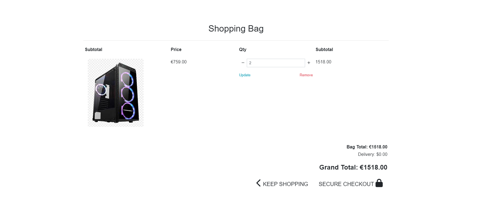

# [Welcome to PC HUB](http://pchub-ac046d943cba.herokuapp.com/)

## Introduction

Welcome to my very own [PC HUB](http://pchub-ac046d943cba.herokuapp.com/).
THIS WEBISTE IS FOR EDICUATIONAL PURPOSES ONLY.
I wanted to create an full-stack e-commerce web application selling gaming computers which I am very passionate about.

### Business Type

The approach I took to this topic is a B2C type of business which means its Business To Customer.

- Business goals addressed with this site
- Build brand awareness;
- Prensent the business value proposition with high-quality content;
- Catch customer's attention and offer a good experience on buying a new Gaming Pc.

How to test a payment:
 
CARD NUMBER:
Visa (debit)	4000056655665556
 
CVC: 
ANY 3 DIGITS
 
DATE:
ANY FUTURE DATE
 

## AGILE Methodology

### User Stories

All User Stories were successfully performed.
Each respective User Story was seperated in a milestone making for a more organised project and helping keeping track of tasks and functions planned to be implemented. Each milestone has a collection of issues that I thought would be helful towards finishing the project and i seperated them in either Fton-Ebd or Back-end.
You can access them [here](https://github.com/andreasarreqi/PcHub/milestoness)

All projects were assigned to epics, prioritized under the labels, Must have, should have, could have. They were assigned to piriority levels "Low Priority" "Medium Priority" "high Priority" . "Must have" stories were completed first, "should haves", "could haves" and finally "Wont have". It was done this way to ensure that all core requirements were completed first to give the project a complete feel, with the nice to have features being added should there be capacity.

The User Stories board was created using github projects and can be viewed to see more information on the project cards. All stories except the documentation tasks have a set of acceptance criteria in order to define the functionality that marks that story as complete.

#### Epics

The project had 7 main Epics (milestones):

EPIC 1 - Site Functionality

The base setup epic is for all stories needed for the base set up of the application. Without the base setup, the app would not be possible so it was the first epic to be delivered as all other features depend on the completion of the base setup.

1. As a developer, I need to set up the general functionality of the website

            
 1. Acceptance Criteria 

 

2. As a developer, I want to create the base.html page and structure so the other pages can use the layout

    

            
 2. Acceptance Criteria 

                 Install Bootstrap
                 Create base.html file
                 Create home app
                 Create home template
                 Add home content
                 Add base.css
                 Create home page sections
                 Style home page sections
    

 

3. As a developer, I need to create a responsive functional navigation bar

    

            
3. Acceptance Criteria 

                Create nav links structure
                Create main nav
    

 

4. As a developer, I need to create a footer section on the main home page so the user can have a contact emain, Privacy Policy and social media links.

    

            
4. Acceptance Criteria 

                Create footer
                Add contact link
                Add Privacy Policy link
                Add social media link
    

5. As a user , I want to be able to contact the website owners

            
 5. Acceptance Criteria 

                Create contacts model
                Create contacts.html
                Create PC technician model
                Create pc_technician.html

 

6. As a developer, I need to set up AWS to store static files of the project

            
 Acceptance Criteria 

                Create AWS account
                Create s3 bucket
                Create bucket user
                Create bucket group
                Set up config variables on settings.py file
                Test AWS static files collection

 

6. As a developer, I need to create error pages for the website

            
 Acceptance Criteria 

                Create 404.html
                Create 500.htm

 

7. As a developer, i need to setup the application for Search Engine Optimization

            
 Acceptance Criteria 

                Add the proper Meta tags
                Create robots.txt
                Create sitemaps
                Email Marketing Newsletter

 

EPIC 2 - Admin 
The Admin epic is for all stories needed for the Admin  related soories.

1. As a developer, I need to create a super user to maintain and update the website.

            
 1. Acceptance Criteria

                Create super user

 

2. As a developer, i need t o implement create/read/update/delete functionality.

            
 2. Acceptance Criteria

                Allow admin to create/read/update/delete a product on the web page

 

3. As a developer, I need to allow the admins to delete a product from the front-end

            
 3. Acceptance Criteria 

                Created The view
                Create the template
                Create the form code

 

EPIC 3 - Account
The Account epic is for all stories related to account

ACCOUNT - USER STORIES

1. As a developer i need to install allauth so the users can register, login, logout.

            
 1. Acceptance Criteria

                Install Allauth
                Create proper links for users to register/login
                Create my profile path so the user can view their purchases

 

2. As a user, I want to be able to have a profile section.

            
 2. Acceptance Criteria

                Create Profiles app
                Create Profile models
                Create profile views
                Create profile templates
                Create profile templates

 

3. As a developer, I need to implement toasts so the user can get feedback based on their actions on the website

            
 3. Acceptance Criteria

                Create Register toasts
                Create Login toasts
                Create Logout toasts
                Toasts display when product is added to bag
                Toasts display when product is deleted from bag
                Toasts when contact/pc technician forms are submitted

 

4. As a user, I want my personal details to be saved so i would not have to re-type everything everytime i want to buy a product

            
 4. Acceptance Criteria

                Save user details on the web page

 

5. As a user, I want to be able to view products that will be arriving soon to the shop.

            
 5. Acceptance Criteria

                Create arrivals app
                Create arrivals model
                Create arrivals view
                Create arrivals template
                Add arrival posts to the website

 

EPIC 4 - Products

This epic is for all stories related to products.

PRODUCTS - USER STORIES

1. As a developer , I need to create the products app so the user can navigate through the products

            
1. Acceptance Criteria 

                Create the products app
                Create super user
                Create the necessary database models

 

2. As a developer, I need to create the product models

            
2. Acceptance Criteria 

                Create Computers model
                Add computer products to database

 

3. As a developer, I need to create the products templates so the user can view the websites products

            
3. Acceptance Criteria 

                Create computers.html
                Create computer_detail.html
                Style computer_detail.html

 

4. As a user, i would like to see the add products to bag and view the bag contents

            
4. Acceptance Criteria 

                Create bag app
                Create bag templates
                Create bag views
                Create bag templatetags
                Add product to bag
                Update product from bag
                Delete product from bag
                Fix quantity input from decrementing below 0 value

 

EPIC 5 - Payments

This epic is for the payment related stories

How to test a payment:
 
CARD NUMBER:
Visa (debit)	4000056655665556
 
CVC: 
ANY 3 DIGITS
 
DATE:
ANY FUTURE DATE
 

PAYMENTS - USER STORIES

1. As a user, I would like to be able to checkout/purchase the products i chose

            
1. Acceptance Criteria 

                Create checkout app
                Create Checkout models
                Create signals.py
                Create forms.py
                Modify apps.py
                Create checkout views
                Create checkout templates
                Create css folder in the checkout app

 

2. As a developer, I need to set up a secure payment system with stripe.

            
2. Acceptance Criteria 

                Install Stripe
                Test payment
                Create Webhooks.py
                Create webhook_handler.py
                Add stripe keys to env
                Add stripe to settings.py

 

EPIC 6 - Deployment

This epic is for the deplyoment related stories

DEPLOYMENT - USER STORIES

1. As a user, I want to see a live website application.

            
1. Acceptance Criteria 

                Deploy to Heroku

 

EPIC 7 - Documentation

This epic is for all document related stories and tasks that are needed to document the software development lifecycle of the application. It aims to deliver quality documentation, explaining all stages of development and necessary information on running, deploying and using the application.

DOCUMENTATION - USER STORIES

As a developer, I want to create a README file to document every step I took creating the project

 Acceptance Criteria 

- Anyone can see the procces of this page's development

 

### Features

Favicon

- The icon on the Browser tab next to the website name.
- There to help the user navigate easier through the browser tab.

 
 

Main Page

- Main page contains the nav bar
- Page sections
- Footer
- Newsletter subscription form

- The first section of the page containing a Header and a link to the shopping page.

  
 
 

 - The second section of the page containing a PC SHOP card and a PC TECHNICIAN card with the link to pc 
   technician form

   
  
  
  

  - The third section of the page containing 3 cards explaining why the costumer should choose us.

  

- The newsletter form allows the users to subscribe to the latest deals.

 

Navigation Bar

Footer

- Footer contains the Social Media link that redirect to each respective link
- Footer contains Opening Hours
- Footer contains Contact link and Privacy policy link
- Footer contains the creator of the website

Login Form

- Login form allows users to log into the website

   
  
  

Logout Form

- Logout form allows user to log out of t he website

  

Register Form

- Register form allows user to create their own account

  
   

Contact Us

- Contact form allows user to contatt the website's administrators.

 PC Technician form

    - Contact form allows user to contatt the website's administrators.

 Update/Delete Form

- Allows admin to update a product from the front-end

- Allows admin to update/delete a product from the front-end

- Allows admin to add a product from the front-end.

 Arrivals Page 

- The page contains products that will soon be available in the store giving the users a short descritpion on   
  what  the product looks like, what it contains and how much it costs.

 Computers page 

- The computers page contains all the products in our store with a descrption about the product.

 Computer detail page 

- The computers Detail page contains the individual product with their respective image and their own properties 
  and description    
- The computer detail page contains a keep shopping button which redirects user to computers page.
- The computer detail page contains add to bag button which allows user to add a product to the bag

 Bag 

- The bag contains the product image

- The bag contains the product price

- The bag contains the product quantity

- The bag contains the product update/remove buttons that allows the user to update quantity and remove the item 
   from bag

- The bag contains the sub total

- The bag contains the delivery cost

- The bag contains the product grand total

- The bag contains the product keep shoping button and the checkout button

 Toasts 

404.html error page

500.html error page

 Checkout 

404.html error page

500.html error page

## Technologies used

- HTML (Templates)
- CSS (Style sheet)
- Python + Django (Programming language + Framework)
- Psycopg2 - ElephantSQL(Database)
- AWS (For storing images)
- Stripe (for payments)
- MailChimp(for emails)
- Git (Version Control)
- Github (Respository)
- GitPod(Cloud IDE)
- Heroku (Live Application Host)

## Packages Installed

Packages were installed using "pip3 install (repackage)

Packages were frozen using "pip3 freeze --local > requirements.txt" so heroku know which packages to install in the project.

                asgiref==3.7.2

                boto3==1.28.11

                botocore==1.31.11

                dj-database-url==2.0.0

                Django==3.2.20

                django-allauth==0.54.0

                django-countries==7.2.1

                django-crispy-forms==1.14.0

                django-storages==1.13.2

                gunicorn==21.2.0

                jmespath==1.0.1

                oauthlib==3.2.2

                Pillow==10.0.0

                psycopg2==2.9.6

                PyJWT==2.8.0

                python3-openid==3.2.0

                pytz==2023.3

                requests-oauthlib==1.3.1

                s3transfer==0.6.1

                sqlparse==0.4.4

                stripe==5.5.0

                urllib3==1.26.16

                backports.zoneinfo==0.2.1;python_version<"3.9"

### Future Features

- Allowing the user to customize the computers and giving them a chance to choose the components of the 
  computer.

- Reviews section so the users can leave a comment/review/feedback on a computer.

## Testing

 PC HUB - Manual Testing 

## Functionality

NAVBAR
HOME PAGE
FOOTER
COMPUTERS( quantity, add to bag button + toast)
PROFILE (IF ADMIN ADD/DELETE PRODUCT)
BAG ( edit,remove, quantity, toast) (empty bag button)
LOGIN( TOAST)
REGISTER(TOAST)
CHECKOUT(Toast+ success)

- As a developer, I need to set up the general functionality of the website

Number| Feature       |    Action     | Expected Result  | Actual Result |
------| ------------- | ------------- | ------------- | ------------- |
   1  | Content Cell  | Content Cell  | Content Cell  | Content Cell  |

            
Evidence 

2. 
- As a developer, I need to set up the general functionality of the website

Number| Feature       |    Action     | Expected Result  | Actual Result |
------| ------------- | ------------- | ------------- | ------------- |
   1   | Content Cell  | Content Cell  | Content Cell  | Content Cell  |

            
Evidence 

3.
- As a developer, I need to set up the general functionality of the website

Number| Feature       |    Action     | Expected Result  | Actual Result |
------| ------------- | ------------- | ------------- | ------------- |
   1   | Content Cell  | Content Cell  | Content Cell  | Content Cell  |

            
Evidence 

4.
- As a developer, I need to set up the general functionality of the website

Number| Feature       |    Action     | Expected Result  | Actual Result |
------| ------------- | ------------- | ------------- | ------------- |
   1   | Content Cell  | Content Cell  | Content Cell  | Content Cell  |

            
Evidence 

5.
- As a developer, I need to set up the general functionality of the website

Number| Feature       |    Action     | Expected Result  | Actual Result |
------| ------------- | ------------- | ------------- | ------------- |
   1   | Content Cell  | Content Cell  | Content Cell  | Content Cell  |

            
Evidence 

6.

- As a developer, I need to set up the general functionality of the website

Number| Feature       |    Action     | Expected Result  | Actual Result |
------| ------------- | ------------- | ------------- | ------------- |
   1   | Content Cell  | Content Cell  | Content Cell  | Content Cell  |

            
Evidence 

7.

- As a developer, I need to set up the general functionality of the website

Number| Feature       |    Action     | Expected Result  | Actual Result |
------| ------------- | ------------- | ------------- | ------------- |
   1   | Content Cell  | Content Cell  | Content Cell  | Content Cell  |

            
Evidence 

8.

- As a developer, I need to set up the general functionality of the website

Number| Feature       |    Action     | Expected Result  | Actual Result |
------| ------------- | ------------- | ------------- | ------------- |
   1   | Content Cell  | Content Cell  | Content Cell  | Content Cell  |

            
Evidence 

9.

- As a developer, I need to set up the general functionality of the website

Number| Feature       |    Action     | Expected Result  | Actual Result |
------| ------------- | ------------- | ------------- | ------------- |
   1   | Content Cell  | Content Cell  | Content Cell  | Content Cell  |

            
Evidence 

10.

- As a developer, I need to set up the general functionality of the website

Number| Feature       |    Action     | Expected Result  | Actual Result |
------| ------------- | ------------- | ------------- | ------------- |
   1   | Content Cell  | Content Cell  | Content Cell  | Content Cell  |

            
Evidence 

## Browser Compatibility

The website works on different browsers: <strong>Chrome, Firefox and Edge.</strong>

### Responsiveness

- Responsiveness was tested using: Chrome Dev Tools.

- Mobile Devices.

## Validator Testing

HTML

HTML validator.
All the pages that get displayed are validated.

 

 

 

 

 

 
 
 
 
  

 

CSS

CSS validator.
All CSS code is validated.

  

Python Validator

PEP8 validator.
All Python code is validated.

 

 

 

 

 

 

 

 

 

 

 

 

  

 

 

 

  

 

  
 
 
 

  

 

 
- Models

- Views

- Forms

- Contact

Lighthouse

Lighthouse.

WAVE

WAVE validator.

### Unfixed Bugs / Other

- A few errors accur in the HTML validator but the web application works fine. The errors maybe appear due to use of Django elemetts in the HTML templates.
- Posts cannot have the same name. Only one post can have a specific name(title/artist name)

## Deployment

- The site was deployed to Heroku. The steps to deploy are as follows:

  - In the Heroku profile, create a new project, name must be unique, location set to Europe
  - From the the project you have just created you can go to the setting page.
  - Once in the settings page, Add the right Configuration Variables to the project. SECRET_KEY DATABASE_URL and CLOUDINARY_URL.
  - Then from there you go to the Deploy page and link your GitHub repo to the project u intented to deploy.
  - Then you can scroll at the end of the page and click on the Deploy Branch
  - After Heroku starts compiling the files and creating your app , after 1 minute or so you'll have your delpyed app link.
  - The deployed app can be found [here](https://rapblog.herokuapp.com/)

## Credits

- [Code Institute](https://codeinstitute.net)
- For the great lessons (I think therefore blog)

- [Favicon](https://favicon.io)
- For the browser tab icon

- [StudyGyaan](https://studygyaan.com/django/how-to-create-a-unique-slug-in-django?utm_content=cmp-true)
- For the tutorial on Slugify

- [Font Awesome.](https://fontawesome.com/)
- For the Social MEdia icons , Like, Comment buttons

- [Bootstrap](https://bootstrap.com)
- Bootstrap was user to create a responsive desing on all platforms.

- [Pexels](https://pexels.com)
- Images were taken from Pexels.

- [<OrdinaryCoders>](https://ordinarycoders.com/blog/article/django-messages-framework)
- Django alert messages when post is added/edited/deleted and when contact form is submited

- [CoduBeta](https://www.codu.co/articles/securing-django-views-from-unauthorized-access-npyb3to_)
- UserPassestestmixin was taken from here.

- [Biograpy](https://www.biography.com/musicians/tupac-shaku)
- Biography of the Artists taken from Biography.

## Acknowledgements

- I would like to thank my mentor Daisy for guiding me.